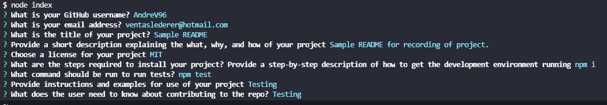

# WriteME
[](https://opensource.org/licenses/MIT)

## Description

The purpose of this project is to create a README Generator to give users an easy to use tool so they can quickly create a README file, already with a template, with the basic information provided by them. With the use of node.js and the inquirer tool, users will be available to run the node index.js command in their terminals and will be prompted with questions regarding the information of their specific porject. Upon answering the questions, the repository will create a README file in the dist folder with all the information provided by the users in an organized template with a table of contents to easily navigate through each section of the README. 

Repository link: https://github.com/AndreV96/WriteME

Link to video showing functionality: https://watch.screencastify.com/v/oIgzLOpwjL8uTKsL36Jj

### Screenshot of prompts and command run:



## Table of Contents 

- [Installation](#installation)

- [Usage](#usage)

- [License](#license)

- [Contributing](#contributing)

- [Tests](#tests)

- [Questions](#questions)

## Installation

To install necessary dependencies, follow the next steps and run these commands:

```bash
npm i
```

## Usage

This app can be used by any developer when they need to add README file to their respository.

## License

This project is licensed under the MIT license

## Contributing

Sole contributor: AndreV96

## Tests

To run tests, run the following command:

```bash
npm test
```

## Questions

If you have any questions about the repository, open an issue or contact me directly at ventaslederer@hotmail.com . You can find more of my work at [https://github.com/AndreV96](https://github.com/AndreV96/).

